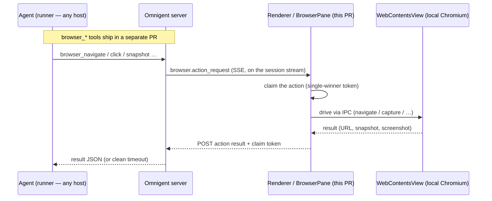

# Omnigent Desktop (Electron)

A thin [Electron](https://www.electronjs.org) desktop shell around the
existing Omnigent web UI. It shows the **same** UI you get in a browser, but
adds native niceties:

- **OS-native desktop notifications** (via the main-process `Notification`
  API) when an agent finishes a turn (`running` → `idle`/`failed`), raises a
  new elicitation (asks for input), or a runner disconnects (`online` →
  `offline`). A notification fires for any such event **except** the one
  conversation you're actively viewing (window focused _and_ that chat
  open). Sessions already settled at launch don't fire; only fresh
  transitions this client observes do. On a turn-end the notification body
  shows the **first few lines of the agent's final message** when they can be
  fetched (one best-effort `GET /items` call), falling back to a generic
  "Agent finished and is ready for your input." On macOS each notification can
  also **play a sound** — a system sound you pick in the **Notifications** menu
  (see below). It's **off by default (opt-in)**: a fresh install stays silent
  until you turn it on, so the sound never surprises you.
- **A foreground attention cue.** macOS (and Windows) suppress the notification
  _banner_ for the **frontmost** app — and macOS suppresses its **sound** too —
  so the notification still lands in Notification Center, but no toast pops (and
  on macOS no sound plays), which reads as "notifications only work when the app
  is in the background." Because the web layer already only notifies for
  sessions you are _not_ actively viewing, the shell adds OS-level cues the
  frontmost app _can_ produce: it **bounces the macOS dock icon** (or flashes
  the taskbar frame on Windows/Linux), and on macOS it **plays the chosen sound
  itself** (via `afplay`) instead of the suppressed notification sound. Because
  the shell plays it, the alert is audible **whether Omnigent is backgrounded or
  in front** — and the toast's own sound is muted so the cue never doubles.
- **Multiple windows** (**Server → New Window**, `Cmd/Ctrl+N`). Each window is
  an independent view, opening on the current window's URL so you can then
  navigate it to a different conversation and watch two side by side. A
  window can also be opened against a **different server** (see "Multiple
  servers" below). Notifications and the dock badge are app-wide (one badge
  for all windows); a notification click focuses the window that fired it.
- **A dock / taskbar badge showing the number of unread sessions** at all
  times (macOS dock badge, Linux Unity launcher count, via
  `app.setBadgeCount`). A session becomes "unread" when it finishes a turn
  or asks for input while you're not actively viewing it, and is cleared the
  moment you view it. Runner disconnects notify but do **not** count toward
  the badge.
- **The standard native menu** (App / Edit / View / Window / Help) built from
  Electron's menu roles, so the usual text-editing shortcuts — Cmd/Ctrl-A,
  C, V, X, Z — work inside the webview's text fields. Our custom actions —
  **New Window**, **New Window on Different Server…**, and
  **Change Server…** — live in a dedicated **Server** submenu. On macOS a
  **Notifications** submenu turns the notification sound on/off (**Play
  Notification Sound**, **off by default** — the user opts in) and picks which
  macOS system sound to play (**Sound ▸** — Glass, Ping, Hero, …); choosing one
  previews it, and the choice persists in `settings.json` and applies to the
  next notification.
- **Browser-style file drag-and-drop** works out of the box: Electron does
  not intercept file drops the way Tauri does by default, so dropping an
  image onto a text field reaches the web app's HTML5 drop handler with no
  extra configuration.
- **Microphone permission for voice dictation.** The composer's dictation
  button uses the Web Speech API plus a `getUserMedia` audio stream (the mic
  level meter). Both go through Chromium's permission layer, which in Electron
  asks the _embedder_ (us) rather than showing Chrome's prompt — with no
  handler wired, Chromium denies by default, so `recognition.start()` fails
  instantly with `not-allowed` and the button appears dead. The main process
  now wires `setPermissionRequestHandler` / `setPermissionCheckHandler` to
  grant the audio permissions, and on macOS calls
  `systemPreferences.askForMediaAccess("microphone")` lazily — on the first
  actual mic request (the user clicking dictate), not at app startup — so the
  OS-level mic gate is open too (packaged builds ship
  `NSMicrophoneUsageDescription`).

  > **Caveat — Web Speech may still not transcribe in Electron.** Granting the
  > mic clears the _permission_ gate, but `SpeechRecognition` also depends on
  > Google's cloud speech backend keyed to official Google Chrome builds, which
  > Electron's bundled Chromium does **not** ship. So recognition can still
  > fail (typically a `network` error) even with the mic allowed. The web app
  > degrades gracefully (the button shows "Dictation unavailable" rather than
  > crashing). Fully reliable in-app dictation would require a MediaRecorder
  > capture + a server-side transcription endpoint (e.g. Whisper) wired to the
  > composer's existing `onAudioRecorded` fallback — not yet implemented.

## How it works (zero UI duplication)

The desktop app does **not** ship a copy of the web UI. It bundles only a tiny
"connect to server" page (`setup/index.html`). On launch:

1. If no server URL is saved yet, it shows the setup page (one input +
   Connect). You enter your Omnigent server URL (default
   `http://localhost:8000`).
2. It persists that URL to the per-user app data dir (`settings.json` under
   Electron's `userData` path) and **loads the server's own origin**, where
   the server serves the real SPA (the production `web` build, the same
   bytes a browser would load).
3. On subsequent launches it skips the setup page and loads the saved server
   directly.

If the saved server fails to load (server down, DNS failure, TLS error), the
window falls back to the setup page with the error shown and the failed URL
pre-filled — the saved URL is kept, so Connect simply retries it.

Entering a plain-`http://` URL for a **non-local** host shows a warning first
(anyone on the network path can act as that server); a second Connect click
proceeds. `http://localhost:8000` connects with no friction.

Change the server later via the **Server → Change Server…** menu item, which
clears the saved URL and returns the focused window to the setup page.

Open another view with **Server → New Window** (`Cmd/Ctrl+N`). It clones the
focused window's current URL onto a new window against the same server, so two
conversations can be watched at once.

The native enhancements live on the web side in
[`../src/lib/nativeBridge.ts`](../src/lib/nativeBridge.ts). It detects the
Electron shell at runtime (the preload exposes `window.omnigentDesktop`
with `kind: "electron"`) and routes notifications/badge through the IPC
bridge; in a plain browser it falls back to the Web Notifications path. So the
one `web` bundle works both in a browser and under Electron.

## Architecture

```
electron/
  package.json             # Electron + electron-builder deps and build config
  src/main.js              # main process: window, settings, menu, IPC, badge, notify
  src/preload.js           # contextBridge: window.omnigentDesktop + omnigentSetup
  src/find_preload.js      # contextBridge for the find bar: window.omnigentFind
  src/browserViewRegistry.js  # per-conversation WebContentsView registry (browser pane)
  src/browserViewBounds.js    # CSS-px → window-DIP bounds conversion (browser pane)
  src/browserIpc.js           # omnigent:browser-* IPC handlers (extracted from main.js)
  setup/index.html         # the bundled "connect to server" setup page
  find/index.html          # the bundled find-in-page bar (Cmd/Ctrl+F)
  icons/                   # app icons
```

Native niceties beyond notifications/badge: a right-click context menu
(cut/copy/paste, spelling suggestions + Add to Dictionary, Copy Link
Address), window size/position persistence across launches, and
find-in-page (**Edit → Find…**, `Cmd/Ctrl+F`) — a small bar anchored to the
window's top-right corner; Enter / Shift+Enter step through matches, Esc
dismisses.

- **Main process** (`src/main.js`) owns settings persistence, window
  creation, the application menu, permission handling (microphone), and IPC
  handlers for the badge and notifications (`normalize_url`, `change_server`,
  navigate-to-server, New Window).
- **Preload** (`src/preload.js`) is the only bridge between the remote
  (untrusted) SPA and the main process. It runs with `contextIsolation` and
  exposes a tiny, serialization-safe API via `contextBridge` — never raw
  `ipcRenderer` or Node.
- **Security posture**: `nodeIntegration: false`, `contextIsolation: true`.
  `window.open` / `target=_blank` links are opened in the user's real
  browser, not chromeless Electron windows — with one narrow exception,
  **OAuth sign-in popups** (next bullet). Non-web schemes (`vscode://`,
  `ssh://`, …) launch an OS protocol handler with page-controlled
  arguments, so they prompt for consent first — showing the requesting
  origin and the full URL — with an optional persisted "always allow this
  scheme from this server". Beyond that, each window is
  **pinned to the one server origin the user explicitly connected it to**,
  and that pin — not navigation — is the trust boundary:
  - Navigation is deliberately _not_ restricted: servers may sit behind
    auth that redirects through external identity providers, so a window
    can legitimately visit foreign origins mid-login.
  - Instead, every privileged IPC handler verifies its sender frame.
    `notify` / `setBadgeCount` only work when both the calling frame _and_
    the window's top-level page are on the pinned origin (so a pinned-origin
    iframe embedded in a hostile page gets nothing); the setup bridge
    (`omnigentSetup`) only works for the bundled setup page itself, so a
    server page can never read or silently re-point the saved server URL.
    Foreign pages get an inert bridge.
  - The microphone permission grant is likewise scoped: only the audio set,
    only for pages on an origin some window is pinned to, and only when the
    requesting page is the top-level page — everything else is denied.
- **OAuth sign-in popups**: the workspace UI's OAuth flows (connect an MCP
  service, Catalog Explorer connections) hand the authorization code back
  via `window.opener.postMessage` plus a nonce in the opener's
  `localStorage` — both exist only in a real, same-profile child window,
  so sending these popups to the external browser strands the code and the
  sign-in fails. A `window.open` is therefore allowed as a real child
  window only when **all** of these hold (`src/popupPolicy.js`): it is
  popup-shaped (explicit width/height features), the opener window is
  pinned and currently _on_ its pinned origin, and the target is `https`
  on the pinned origin itself, a well-known OAuth authorization host
  (github.com, accounts.google.com, slack.com, mcp.atlassian.com,
  auth.atlassian.com, login.microsoftonline.com, salesforce.com), or
  hand-listed in `settings.json` under `popup_allowed_origins`. The child
  is hardened (`hardenOauthPopup`): it never gets the shell preload (a
  no-op `popup_preload.js` instead), runs sandboxed, shows the **current
  host in its title** on every navigation (the page can't control the
  prefix), and cannot open popups of its own. It is never entered in the
  shell's window registry, so it gains none of that registry's privileges
  — its only grant is the auth-surface localhost trust described below
  (sign-in chains run IdP device-trust checks, e.g. Okta FastPass, inside
  the popup). The shell also strips `Cross-Origin-Opener-Policy` from
  main-frame responses inside these popups (and only there): a COOP:
  same-origin hop — slack.com's sign-in pages serve one — would sever
  `window.opener` mid-flow, which both kills the code hand-off and makes
  the opener misread the popup as closed, so first-time sign-ins fail
  while retries succeed. Custom providers on other domains fall back to
  the external browser; add their authorization origin to
  `popup_allowed_origins` to sign in without leaving the app:

  ```json
  { "popup_allowed_origins": ["https://sso.my-git-host.example.com"] }
  ```

## Embedded browser pane

The desktop shell hosts an **embedded browser pane**: a real Chromium page the
user can drive (URL bar + toolbar) and point-and-prompt in design mode. This PR
covers that user-facing pane plus the Electron/renderer plumbing; the
agent-facing builtin `browser_*` tools (navigate / snapshot / click / type /
screenshot) that can also drive the pane land in a separate PR. A
webview/iframe can't provide screenshots, arbitrary in-page JS, or cross-origin
navigation, so each browser is a native Electron **`WebContentsView`**
positioned over a placeholder `<div>` the SPA measures — not an in-page element.



The browser runs on the user's machine (a native `WebContentsView`); the agent —
which may run on a different host — drives it purely by messages: an action
request fans out over the session stream, the renderer claims and executes it
against its local Chromium, and the result is posted back.

**Pieces:**

- `src/browserViewRegistry.js` — a per-**conversation** `Map` of
  `WebContentsView`s (cap 10). `setActive` attaches one view to the host window
  and **detaches (does not destroy)** the previous one, so a background
  conversation's page keeps running when the user switches away; views are
  destroyed only on explicit close or window teardown. Each child view keeps
  `nodeIntegration:false, contextIsolation:true, sandbox:true`.
- `src/browserViewBounds.js` — converts the placeholder's renderer CSS pixels to
  window device-independent pixels (they diverge after `Cmd+/Cmd-` zoom).
- `src/main.js` — instantiates one registry **per shell window** and injects it
  (plus the `isPinnedOriginSender` trust gate) into `registerBrowserIpc(...)`.
- `src/browserIpc.js` — the whole `ipcMain.handle('omnigent:browser-*')` surface,
  extracted out of `main.js` so that file stays bounded:
  `open-or-navigate`, `set-active`, `resize`, `screenshot`
  (`capturePage().toPNG()` → base64), `execute`, `has-view`, `close`, plus the
  toolbar handlers `go-back`, `go-forward`, `reload`, and `open-devtools`
  (toggle, docked bottom), plus the design-mode handlers
  `enable-design-mode` / `disable-design-mode` / `signal-design-result`
  (inject / tear down the in-page element picker and paint result feedback).
  Every handler is gated on `isPinnedOriginSender` (only
  the connected server's own page may drive the views) and resolves the _sender
  window's own_ registry, so one window can never manipulate another's panes.
  On view creation it also wires `did-navigate` / `did-navigate-in-page`
  listeners that push `browser-url-changed` + `browser-nav-state` to the renderer
  so the toolbar's URL bar live-tracks the real URL (redirects, in-page link
  clicks, agent navigation) instead of going stale.
- `src/preload.js` — adds `browserOpenOrNavigate/SetActive/Resize/Screenshot/`
  `Execute/Close` + `browserHasView`, the toolbar methods
  `browserGoBack/GoForward/Reload` + `openBrowserDevTools`, the design-mode
  methods `browserEnableDesignMode/DisableDesignMode/SignalDesignResult`, and the
  subscriptions `onBrowserViewCreated` / `onBrowserHostActiveChanged` /
  `onBrowserViewClosed` / `onBrowserUrlChanged` / `onBrowserNavState` +
  `onBrowserElementSelected` / `onBrowserElementPromptSubmit` /
  `onBrowserElementPromptDismiss` to `window.omnigentDesktop`, each a thin
  `ipcRenderer.invoke` / `ipcRenderer.on`.
- Renderer side (in `web/src`): `hooks/useBrowserAgentRelay.ts` receives the
  `browser.action_request` SSE event (emitted by the separate agent-tools PR),
  **claims** the action on the server
  (atomic check-and-set so two windows on one server can't double-execute),
  runs it via the preload bridge, and POSTs the result back with its claim
  token; `components/BrowserPane/BrowserPane.tsx` measures the placeholder and
  keeps the native view positioned over it. Both self-gate on
  `isElectronShell()`, so a plain browser tab is inert (the action times out on
  the server with a clean "is the desktop app open?" error).

**First-navigate activation.** The first `browser_navigate` on a conversation
creates the view **detached** (nothing is active yet), so no
`browser-host-active-changed` fires. The registry therefore also emits a
`browser-view-created` event on create; `BrowserPane` listens for it (and
probes `browserHasView` on remount), mounts its measuring placeholder, and
calls `browserSetActive(conversationId)` — which attaches the view and starts
bounds sync. Without this signal the pane would gate itself off forever and the
embedded browser would stay invisible. (`browserViewRegistry.test.js` locks the
create-signal → setActive → attached transition.)

**Toolbar.** When a view is attached, `BrowserPane` renders a user-facing
toolbar above the page: back / forward / reload, a DevTools toggle, and an
editable URL bar (Enter navigates; the typed value is normalized to add a
scheme — a dotless host like `localhost` gets `http://`, everything else
`https://`). The bar reflects the _real_ URL via `onBrowserUrlChanged`, but
never overwrites what the user is actively typing. The pane is a flex **column**:
the toolbar is a fixed-height row _above_ the measured container, because the
native `WebContentsView` paints over that container's rect — a toolbar inside it
would be hidden by the overlay. The URL bar reuses the existing
`browserOpenOrNavigate(..., {force:true})` path (the same one the relay uses), so
no separate navigation IPC exists for manual entry.

**Design mode (point-and-prompt).** A toolbar toggle (next to DevTools) injects
an in-page element picker into the `WebContentsView` via `executeJavaScript`:
hovering highlights the element under the cursor (overlay + `<Component>`/tag
label); clicking opens a popup anchored to that element with an input + Send.
On Send the popup emits a `console.log` marker (the injected script can't
`require('electron')`), which the per-view console-message listener in
`browserIpc.js` forwards to the SPA as `browser-element-prompt-submit`
(carrying the element info; a cropped element screenshot arrives on the earlier
`browser-element-selected` event). **There is no backend
design-edit route** — `AppShell` (where the relay is hoisted, so it's listening
even when the Browser tab isn't mounted) builds a `[Design Mode — …]` prompt,
attaches the screenshot as a `File`, and sends it through the _normal_ chat
path (`chatStore.send`, targeting the conversation's own bound agent). It then
calls `browserSignalDesignResult` so the popup paints green/red feedback. The
picker markers are `__omni_element_select__` / `__omni_element_prompt_submit__`
/ `__omni_element_dismiss__`, and the per-view
console listener is stored on the registry entry
(`designModeListener` / `designModeWebContents`) so `browserViewRegistry`'s
`close()` detaches it on teardown. Electron-only (needs `executeJavaScript` +
the native view); no server flag.

**JS trust boundary (important):** `omnigent:browser-execute` runs
arbitrary JS in the child view via `executeJavaScript(js, true)`. It is exposed
to the SPA **only for the relay's own fixed templates** (the DOM-snapshot walk,
and the click / type element resolvers) — there is deliberately **no
agent-facing generic `evaluate`**. This keeps the _agent_ boundary: the agent
picks elements by `ref`/`selector` and supplies text, but never ships a raw JS
string that main will run. (It does not, and is not intended to, defend against
XSS _within_ the visited page — that page runs its own scripts in its own
sandboxed view regardless.) Preserve this when extending the bridge: add typed,
argument-shaped actions, not a passthrough JS channel.

**Availability.** The pane is always on in this build — this shell machinery
activates the moment a `browser.action_request` arrives (the agent-side
`browser_*` tools that emit it ship in the separate tools PR). No flag to enable
it. Outside the Electron shell (a plain browser tab)
the renderer half is inert, so the tools fail cleanly with a "is the desktop
app open?" error rather than hanging.

## Prerequisites

- **Node** 22.x + npm (already used by `web`).
- Electron ships its own Chromium/Node, so no system webview libs are needed
  on Linux for _running_ the built app, though packaging tools may pull a few
  build deps.

## Run it (development)

From the `web/electron/` directory:

```bash
npm install     # installs electron + electron-builder
npm start        # launches the Electron shell
```

The shell opens on the bundled setup page. Point it at a running Omnigent
server (see below), Connect, and you're in.

> Note: this loads the UI from whatever server URL you give it — it does
> **not** run the Vite dev server. To develop the web UI itself with hot
> reload, run `npm run dev` (plain Vite in a browser) from `web/` as usual.

## Build a distributable

From `web/electron/`:

```bash
npm run build             # current platform
npm run build:mac         # .dmg + .zip (signed if an identity is available, not notarized)
npm run build:mac:release # .dmg + .zip, signed + notarized (requires credentials, see below)
npm run build:linux       # AppImage + .deb
npm run build:win         # NSIS installer
```

Output lands in `electron/dist/` (the DMG is named
`Omnigent-<version>-<arch>.dmg`).

## macOS code signing & notarization

The mac build is configured for Apple's **hardened runtime** with the
entitlements Electron needs (`build/entitlements.mac.plist`: V8 JIT plus
microphone for dictation). Signing is driven entirely by what credentials
are present — there are no code changes between a dev build and a release
build:

| Credentials present                                                | Result                                                               |
| ------------------------------------------------------------------ | -------------------------------------------------------------------- |
| none                                                               | ad-hoc–signed app; runs locally, other Macs see a Gatekeeper warning |
| Developer ID cert                                                  | signed app; downloads still warn until notarized                     |
| Developer ID cert + Apple notarization creds (`build:mac:release`) | signed + notarized; installs cleanly everywhere                      |

### 1. Get a signing certificate

You need a **Developer ID Application** certificate from an Apple Developer
Program account (the kind used for distribution _outside_ the App Store).
Create it at <https://developer.apple.com/account/resources/certificates>
(or via Xcode → Settings → Accounts → Manage Certificates), then either:

- **Keychain (local builds):** install the cert + private key into your
  login keychain. electron-builder auto-discovers it — `npm run build:mac`
  just works. Verify with
  `security find-identity -v -p codesigning` (you should see
  `Developer ID Application: <Your Name> (<TEAMID>)`).
- **Env vars (CI):** export the cert + key as a password-protected `.p12`
  and set:

  ```bash
  export CSC_LINK=/path/to/developer-id.p12   # or a base64 string / https URL
  export CSC_KEY_PASSWORD='the p12 password'
  ```

To force an **unsigned** build even when a cert is present (faster dev
iteration): `CSC_IDENTITY_AUTO_DISCOVERY=false npm run build:mac`.

### 2. Notarize (release builds)

Notarization uploads the signed app to Apple for malware scanning;
without it, macOS warns on first launch of a downloaded app. It needs
network access and Apple credentials — either an App Store Connect API
key (preferred for CI):

```bash
export APPLE_API_KEY=/path/to/AuthKey_XXXXXXXXXX.p8
export APPLE_API_KEY_ID=XXXXXXXXXX
export APPLE_API_ISSUER=<issuer-uuid>
```

or your Apple ID with an [app-specific password](https://support.apple.com/102654):

```bash
export APPLE_ID=you@example.com
export APPLE_APP_SPECIFIC_PASSWORD=xxxx-xxxx-xxxx-xxxx
export APPLE_TEAM_ID=<TEAMID>
```

then:

```bash
npm run build:mac:release
```

This is the same build with `mac.notarize=true` switched on; expect the
notarization step to add a few minutes (Apple-side processing). Verify the
result with:

```bash
spctl -a -vv dist/mac-arm64/Omnigent.app   # → "accepted, source=Notarized Developer ID"
```

`build:mac:release` **fails loudly** if signing or notarization
credentials are missing — that's intentional, so a release artifact can't
silently ship unsigned.

## Getting a server to point at

Any reachable Omnigent server works. For a quick local target, run the
server from this repo:

```bash
# from the repo root, with the project venv:
.venv/bin/python -m omnigent.server   # serves on http://localhost:8000
```

Then enter `http://localhost:8000` in the setup page.

## Managing servers and hosting

Beyond pointing at an already-running server, the shell can drive the local
`omnigent` CLI to start a server and register this machine as a **host** (a
machine that runs the agent work a server dispatches). Two concepts stay
deliberately separate:

- **Server** — the backend the webview talks to (local or remote).
- **Host** — _this machine_ executing agent work for a server. Because hosting
  runs agent code, it is **opt-in** and **explicit**: the shell never connects
  this machine as a runner on its own — not on connect, not on launch. You
  connect it from the **host selection menu** inside the app (when starting a
  chat, pick this machine), which drives `controlHost` over the bridge. That
  request alone isn't trusted to authorize hosting: the SPA is served by the
  server, so `start`/`restart` additionally require a **native, main-process
  confirmation** the page can't forge or auto-dismiss (persisted per server
  origin, so a trusted server is asked only once).

### Detecting the CLI and customizing its path

The CLI ships under two names that resolve to the same entry point — `omnigent`
(canonical) and `omni` (short alias) — and the shell probes **both**:
`settings.omnigent_path` first, then `PATH` (`omnigent` then `omni`), then the
well-known install locations (`~/.local/bin`, `~/.cargo/bin`, Homebrew,
`/usr/local/bin`, each tried under both names). A GUI-launched app inherits a
minimal `PATH`, which is why the install locations are probed directly. The path
is resolved once at startup and cached in-memory for the session.

You can see and change which binary is used in two places:

- **Setup page** — hidden by default behind a **gear icon** (top-right) that
  opens a small modal. The resolved/auto-detected path shows as the field's
  **placeholder** (the value stays empty until you type an override); set it via
  free-text or a native file picker. When nothing is found the gear gets an
  accent dot and the modal shows the install one-liner
  ```bash
  curl -fsSL https://raw.githubusercontent.com/omnigent-ai/omnigent/main/scripts/install_oss.sh | sh
  ```
- **In-app** — **Settings → Local CLI** (desktop only): shows the resolved path
  and version, a **Change…** button (native file picker) and **Reset to
  auto-detected**. For safety the in-app surface exposes **no free-text setter**
  — a connected server must not be able to silently repoint the CLI at an
  arbitrary binary, so changing it requires a user-driven OS dialog.

A configured path is saved to `settings.json` (`omnigent_path`) only once it
validates as a runnable CLI; clearing it reverts to auto-detection. Connecting
to a **remote** server never needs the CLI — only "Start locally" and hosting do.

### Start locally

**"Start a server on this machine"** runs `omnigent server start` (idempotent —
reuses a healthy one) and then connects this window to its
`http://127.0.0.1:<port>` URL through the normal connect flow. It does not
connect this machine as a runner — that stays an explicit step in the app.

### Connecting this machine as a runner

There is **no** connect-time toggle and no sidebar status row: the shell never
connects a runner automatically. Inside the connected app, the host selection
menu (when starting a chat) tags this machine and offers to connect it. Choosing
it calls `controlHost("start")` over the bridge. Because that call originates in
server-served code, the main process does not treat it as the user's consent: on
the first `start`/`restart` for a server origin it shows a **native confirmation
dialog** ("Allow _host_ to manage Omnigent on this machine?") with **Don't Allow**
(default) / **Allow Once** / **Always Allow**. Only after approval does it — once
the CLI is authenticated for the server (remote only; local needs none) — either
adopt a daemon already serving that server (one you started by hand) or spawn
`omnigent host --server <url>`. **Allow Once** connects this time and re-prompts
next time; **Always Allow** records the origin in `settings.json`
(`allowed_hosting_origins`) so later connects skip the prompt. `stop` is
fail-safe and needs no confirmation. The same bridge exposes `stop` / `restart`.

Status is read live (host connected = a live daemon process **and** an online
host tunnel; the shell never caches it). The host surface goes through the JS
bridge — `window.omnigentDesktop` → `getHostStatus` / `getHostIdentity` /
`onHostStatusChanged` (read + live) and `controlHost` (start/stop/restart),
typed in [`../src/lib/nativeBridge.ts`](../src/lib/nativeBridge.ts) and gated to
the window's **pinned origin** like the badge/notification bridge.

### Lifecycle

The desktop **owns the host processes it starts**: quitting the app SIGTERMs
them (and stops a local server it started), so closing the app disconnects this
machine. A daemon the shell merely _adopted_ (you started it in a terminal) is
left running on quit. Hosting is **not** restored on the next launch — you
reconnect this machine explicitly from the host menu when you want it.

## Passkeys (WebAuthn)

External security keys (e.g. a YubiKey) work out of the box: Chromium's
content layer speaks CTAP to the key directly. That's also why the flow is
_invisible_ — the passkey sheet you see in Chrome/Safari is browser chrome,
which Electron doesn't ship. Touching the key completes the ceremony with no
UI.

For a visual flow, the shell enables Electron's **Touch ID platform
authenticator** (`app.configureWebAuthn`, Electron ≥ 42, macOS only):
registering or signing in with a platform passkey then shows the native
macOS Touch ID / keychain dialog, and a native chooser appears when several
saved passkeys match. Three pieces must agree before this activates:

1. `WEBAUTHN_KEYCHAIN_ACCESS_GROUP` in `src/main.js` —
   `"<TEAM_ID>.ai.omnigent.desktop"`.
2. The same string in the `keychain-access-groups` entitlement in
   `signing/entitlements.mac.plist`.
3. An **embedded Developer ID provisioning profile**
   (`signing/omnigent.provisionprofile`, wired via `provisioningProfile`
   in `package.json`). `keychain-access-groups` is a _restricted_
   entitlement: a Developer ID signature alone doesn't authorize it, and
   AMFI SIGKILLs the app at launch ("Launchd job spawn failed", POSIX
   error 163). Create the profile in the Apple Developer portal: an App ID
   for `ai.omnigent.desktop` (no extra capabilities — every profile
   automatically authorizes keychain groups under `<TEAM_ID>.*`), then
   Profiles → Distribution → Developer ID for that App ID. Verify with
   `security cms -D -i signing/omnigent.provisionprofile`.

The signing identity's team must match the group prefix —
`package.json` pins `"identity"` for this reason (with several certs in
the keychain, electron-builder's auto-discovery can pick the wrong one).
Helpers must NOT inherit the keychain entitlement
(`entitlementsInherit` points at the minimal
`signing/entitlements.mac.inherit.plist`; a restricted entitlement on a
helper shows up as a "GPU process exited unexpectedly" crash loop).

It only works in a **code-signed** build, on Macs with a Secure Enclave.
Until all three are set — and always in unsigned `npm start` dev runs —
the platform authenticator stays off and security keys remain the
(working, silent) path.

Caveats: these passkeys are device-bound in the app's own keychain access
group — they are **not** synced via iCloud Keychain, and passkeys you saved
in Safari/Chrome are not visible to the app (and vice versa). Showing the
full system passkey sheet (iCloud Keychain, cross-device QR) for arbitrary
user-chosen servers would require Apple's browser-only
`web-browser.public-key-credential` entitlement, or per-domain associated
domains — neither fits an app whose servers are user-deployed.

## Localhost access (auth flows)

Trusted pages may call services on the user's own machine
(`http://localhost:<port>`, `127.0.0.1`, `[::1]`) even when those
services don't send CORS headers — authentication flows use this to
reach local auth helpers/token brokers. The shell injects the CORS (and
preflight) response headers itself, scoped to requests _from_ a trusted
page origin _to_ a loopback host; see `src/localhost_cors.js`. Trusted
means:

- a window's **pinned server origin**, or
- the **current top-level page of a pinned window** — auth flows
  redirect the main frame through SSO/IdP origins that can't be known in
  advance (server → SSO domain → localhost helper probe), and those
  pages get localhost access while the user is actually on them.
  In-window navigation only starts from the pinned server (links open in
  the external browser), which keeps this from extending to arbitrary
  sites; iframes never match (main-frame origin only). The **current
  top-level page of a live OAuth sign-in popup** gets the same trust for
  the same reason — the IdP device-trust checks (Okta FastPass) run
  _inside_ the popup and fail closed without it — bounded the same way:
  popups only ever start on allowlisted sign-in hosts, and a closed popup
  confers nothing. Popups gain no other shell-window privileges.

Anything else stays blocked by normal CORS, and a localhost service that
sends its own `Access-Control-Allow-Origin` keeps enforcing its own
policy untouched.

If a page needs localhost while _not_ being the visible top-level page,
hand-add its origin to `settings.json`:

```json
{ "localhost_allowed_origins": ["https://login.example.com"] }
```

(`settings.json` lives in Electron's per-user `userData` dir — on macOS,
`~/Library/Application Support/Omnigent/settings.json`.)

## Multiple servers

One server URL is saved as the default, but extra windows can be opened
against _different_ servers via **Server → New Window on Different
Server…**. It opens a setup page in **per-window** mode: the URL you connect
applies to that window only and is never saved, so the default server is
untouched and the extra connection ends when the window closes. These
windows get the same per-window origin pinning as regular ones. With windows
on more than one server, the dock badge shows the sum of each server's unread
count and notification titles are prefixed with the firing server's hostname.

## Deep links

An `omnigent://<hostname>/c/<session_id>` URL opens that session on that
server in the desktop app — the way a browser deep link opens a page:

```
omnigent://localhost:8000/c/conv_abc              → http://localhost:8000/c/conv_abc
omnigent://my-workspace.cloud.databricks.com/c/x → https://…/ml/omnigents/c/x
```

The link names a server by **host** (with port if non-default) and carries no
`http`/`https` — the shell infers the scheme with the same rule the setup page
uses (`http` for loopback, `https` for a remote host), so a deep link and a
pasted URL can never disagree. The Databricks workspace mount (`/ml/omnigents`)
is **not** in the link; it is server-determined and discovered the same way a
pasted workspace URL is. v1 accepts only `/c/<session_id>`; other paths are
ignored.

**Window handling** (the careful part):

- A window already open on that server and currently on its page is **reused
  in place** — the shell tells the SPA's router to navigate to the conversation
  without a reload, so the in-flight stream isn't dropped. (Same basename-less
  `/c/<id>` path a notification click routes.)
- A window pinned to that server but mid-SSO-redirect (off the server origin)
  is **reused with a reload** to the conversation, since the SPA's listener
  isn't reliably mounted on a foreign IdP page.
- A server you've **previously connected to** (in the recent-servers list or
  the saved default) but have no live window for opens in a **new window** —
  no prompt, the way a second tab for a known site would.
- A server you have **never connected to** prompts with a native confirmation
  dialog (Cancel is the default). Pinning a new origin is a privilege grant
  (notifications, badge, mic), so a clicked link never silently pins an
  attacker-chosen origin; once you allow it, the server is remembered so the
  next link is frictionless.

**Cold start vs warm start.** On macOS, `open-url` fires for the link and can
arrive **before** the app is ready, so pre-ready links are queued and drained
once the windows exist. On Windows/Linux, a second launch carrying the URL is
funneled to the running instance by the single-instance lock. Links are
handled one at a time, so two arriving together can't race two consent
dialogs. At cold start the deep link replaces the default launch window; if you
cancel an unknown-server prompt, a normal launch window opens instead.

**Registration.** The scheme is registered two ways: the build manifest
(`build.protocols` in `package.json`, which writes `CFBundleURLSchemes` on
macOS, a `.desktop` `MimeType` on Linux, and registry entries on Windows) for
packaged installs, plus a runtime `app.setAsDefaultProtocolClient("omnigent")`
call so `electron .` dev clicks route to the running dev instance.

The decision logic (parse + window selection) is pure and unit-tested in
`src/deepLink.js`; the orchestration lives in `src/main.js`.

## Implementation notes

- **Runtime:** bundled Chromium (so the build is ~100+ MB, but the renderer
  matches Chrome's behavior exactly — no OS-webview quirks).
- **Native bridge detection:** `window.omnigentDesktop` (`kind: "electron"`),
  exposed by the preload. The web-side `nativeBridge.ts` routes the badge to
  `app.setBadgeCount` and notifications to the main-process `Notification` API
  via IPC; in a plain browser it falls back to the Web Notifications path.
- **File drag-drop** works by default (Electron doesn't intercept HTML5 file
  drops).
- **Toolchain:** Node only — no Rust or platform webview libraries.

> Historical note: an earlier Tauri-based shell lived in `web/src-tauri`.
> It was removed in favor of shipping Electron only; `nativeBridge.ts` no
> longer carries a Tauri code path.
